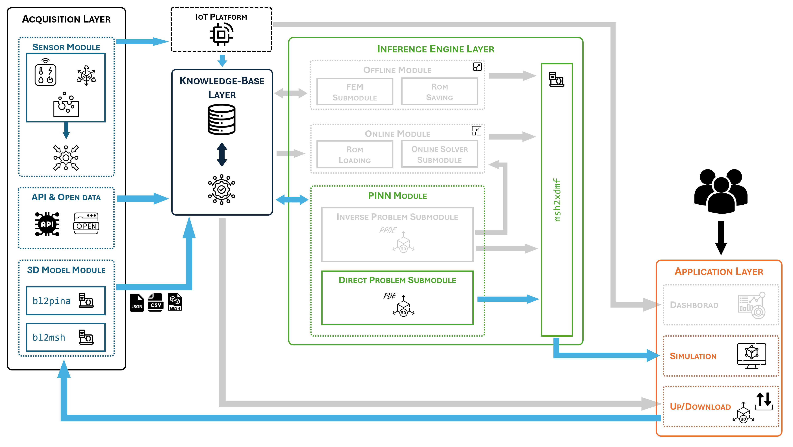

# Direct Physics-Informed Problems on 3D Models

This folder contains the implementation of **PDE problems** solved on complex 3D geometries using **Physics-Informed Neural Networks (PINNs)**.  
In this setting, the governing physical equations are assumed to be known, and the objective is to **reconstruct the solution fields directly on the 3D domain**, optionally integrating simulated IoT-like data.

The workflows implemented here focus on **physics-constrained inference** without parameter identification, and are designed to demonstrate how PINNs can operate directly on realistic digital replicas.

## Folder Structure

- `tp3/` – Direct PINN solution of a heat transfer problem on a 3D rock geometry  
- `tp4/` – Direct PINN solution of a Poisson system on a 3D column geometry, with and without data integration  

### The proposed framework enabled modules

---

## TP3 – Heat Equation on a 3D Rock

The folder `tp3/` implements a **PINN-based solution** of the heat equation on a complex 3D rock geometry.

### Workflow
1. **Problem setup**
   - Generation of simulated boundary data  
   - Mesh creation from the Blender model  
   - Preparation of `.xdmf` files for visualization  

2. **Direct PINN inference**
   - Solution of the heat equation using PINNs  
   - Reconstruction of the temperature field over the 3D domain  

3. **Post-processing**
   - Generation of `.xdmf` outputs for simulation inspection and visualization  

This test problem illustrates how PINNs can be used to perform **physics-consistent temperature monitoring** on  3D cultural heritage assets.

---

## TP4 – System of Poisson PDEs on a 3D Column

The folder `tp4/` addresses a **system of Poisson PDEs** defined on a 3D column geometry and highlights the role of data integration in PINN-based solvers.

### Workflow
1. **Problem setup**
   - Generation of simulated data  
   - Mesh creation and `.xdmf` preparation  

2. **Direct PINN inference**
   - PINN-based solution **with simulated data integrated** as observational constraints  
   - PINN-based solution **without data**, relying solely on physical laws  

3. **Comparison and visualization**
   - Analysis of the impact of data integration  
   - Visualization of solutions via `.xdmf` files  

This test problem demonstrates the flexibility of PINNs in combining **purely physics-based** and **hybrid physics–data-driven** inference on complex 3D domains.