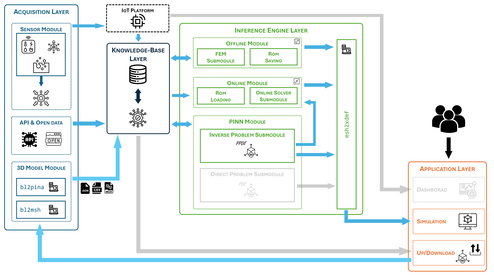

# Inverse Physics-Informed Problems on 3D Models

This folder contains the implementation of **inverse physics-informed problems** on complex 3D geometries, where **unknown physical parameters are inferred from simulated IoT-like data** by combining **Physics-Informed Neural Networks (PINNs)** and **Reduced Order Models (ROMs)**.

The workflows implemented here follow an **offline–online paradigm**, in which high-fidelity numerical simulations are used to construct reduced-order surrogates, while PINNs are employed to solve inverse problems and identify the governing parameters.

## Folder Structure

- `tp1/` – Inverse parametrized Poisson problem on a 3D rock geometry  
- `tp2/` – Inverse parametrized parabolic PDE system on a 3D column geometry 

### The proposed framework enabled modules

---

## Common Workflow (TP1 and TP2)

Both `tp1/` and `tp2/` follow the same four-stage pipeline:

1. **`00_ProblemSettings`**  
   - Definition of the parametrized physical problem  
   - Generation of **simulated sensor data**  
   - Mesh generation from the Blender 3D model  
   - Creation of `.xdmf` files to enable visualization  

2. **`01_OfflineStage`**  
   - High-fidelity FEM simulations  
   - Construction of the **POD-based Reduced Order Model (ROM)**  
   - Error analysis and assessment of the reduced basis  

3. **`02_SolveInverse`**  
   - Solution of the **inverse problem** using Physics-Informed Neural Networks  
   - Identification and approximation of the unknown physical parameters  

4. **`03_OnlineStage`**  
   - Online POD evaluation using the parameters inferred by the PINN  
   - Comparison with reference solutions computed using known parameters  
   - Generation of `.xdmf` files for solution and error visualization  

---

## TP1 – Parametrized Poisson Equation on a 3D Rock

The folder `tp1/` addresses a **scalar parametrized Poisson equation** defined on a 3D rock geometry.  
The objective is to infer the governing parameters of the PDE from simulated boundary measurements and to reconstruct the solution efficiently using a reduced-order surrogate.

---

## TP2 – Parametrized Parabolic PDE System on a 3D Column

The folder `tp2/` focuses on a **time-dependent parametrized system of parabolic PDEs** defined on a 3D column geometry.  
This test problem extends the inverse setting to a more complex scenario involving temporal dynamics and coupled fields, demonstrating the robustness of the PINN–ROM integration.

---

Overall, the inverse problems in this folder showcase how **simulated IoT data, physics-informed learning, and reduced-order modeling** can be coherently combined to perform parameter identification and efficient inference on realistic 3D digital assets.
